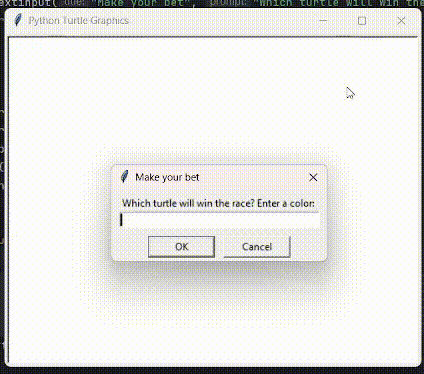

# 🐢 Bet on your Turtle: Race Game (Python and Turtle)

A fun little turtle race game where you can bet on your turtle made using the `turtle` graphics module in Python 🐢🎮  

## 🎮 How it works:
- Pick a turtle color to bet on
- Watch the race live!
- Find out if you win or lose — results appear on screen

## 🛠 Built With:
- Python 3
- Turtle module
- Random module

## 💡 Features:
- 6 racing turtles with different colors
- Random movement logic
- On-screen winner announcement

## 🎮 Preview

Place your bet, watch the turtles go, and see who wins the race!

